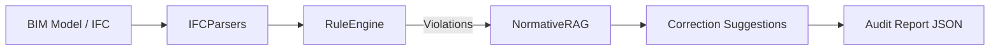

# 🧠 BIM-Lawyer

**Autonomous Normative Auditor & Building Code Compliance AI**

BIM-Lawyer is a normative intelligence engine designed to automate the process of **Rule Checking (ARC)** in the AECO industry. It translates complex building codes (IBC, ADA, ISO) into executable logic, acting as an autonomous auditor that ensures design compliance directly from BIM model data.

---

## 🚀 Key Features

- **Automated Rule Checking (ARC)**: Validates geometric parameters (door widths, ramp slopes, stair clearances) against **IBC 2021** and **ADA** standards.
- **Normative RAG-LLM**: A Retrieval-Augmented Generation layer that interprets natural language building codes to explain violations.
- **Cloud-Native Ingestion**: Simulated IFC extractors ready for integration with Forge, Speckle, or private BIM servers.
- **Autonomous Audit Reports**: Generates detailed compliance risk summaries and AI-driven design remedies.

## 🏗️ Architecture



## 🛠️ Getting Started

1. **Install Dependencies**:
   ```bash
   pip install -r requirements.txt
   ```

2. **Integration Example**:
   ```python
   from core.rule_engine import RuleEngine
   from ingestion.ifc_mock import IFCMockParser
   
   # 1. Fetch data
   elements = IFCMockParser().get_extracted_elements()
   # 2. Audit
   report = RuleEngine().batch_audit(elements)
   ```

3. **Start Audit Service**:
   ```bash
   uvicorn api.main:app --reload
   ```

## ⚖️ Standards Supported
- **International Building Code (IBC) 2018/2021**
- **ADA Standards for Accessible Design**
- **ISO 16739 (IFC Data Schemas)**
- **ISO 21597 (Information container for data drop)**

---
*Developed by Maycon Alves for the NexusTwin Ecosystem.*
