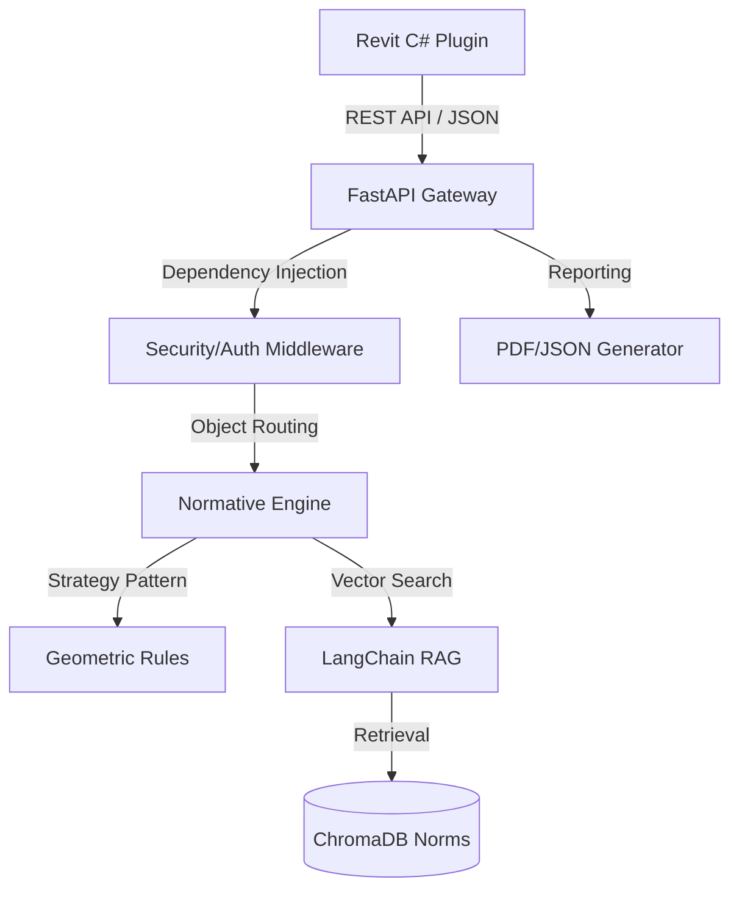

# <p align="center">BIM-Lawyer | Advanced Normative Auditing</p>

<p align="center">
  
</p>

<p align="center">
  
  
  
  
  
</p>

---

### ⚖️ Architectural Foundation

**BIM-Lawyer** is a high-performance, production-ready normative auditing system for the AEC (Architecture, Engineering, and Construction) industry. It leverages an object-oriented **Strategy Pattern** to validate complex BIM geometry against international building codes (ADA, IBC, NBR 9050).

Designed for feature parity with **EcoBIM-Logic**, this repository demonstrates a mature multi-tier service architecture.


```mermaid
graph TD
    A[Revit C# Plugin] -- REST API / JSON --> B[FastAPI Gateway]
    B -- Dependency Injection --> C[Security/Auth Middleware]
    C -- Object Routing --> D[Normative Engine]
    D -- Strategy Pattern --> E[Geometric Rules]
    D -- Vector Search --> F[LangChain RAG]
    F -- Retrieval --> G[(ChromaDB Norms)]
    B -- Reporting --> H[PDF/JSON Generator]
```

### 🚀 Key Enterprise Features

- **Multi-Language Bridge:** A complete C# Revit Add-in that serializes internal geometry and communicates with the Python backend.
- **Automated Geometry Normalization:** Native Revit "Decimal Feet" units are automatically converted to Metric validation models via Pydantic `@validators`.
- **RAG-Powered Explanations:** Beyond "Fail/Pass", the system cites exact regulatory clauses using a LangChain-based Vector Retrieval system.
- **Production Infrastructure:** Fully containerized via **Docker**, featuring centralized logging and global configuration.

---

### 🛠️ Professional Setup & Deployment

#### Backend (Python)
1. **Environment Setup:**
   ```bash
   pip install -r requirements.txt
   ```
2. **Launch API:**
   ```bash
   uvicorn api.main:app --reload
   ```
3. **Docker Deployment:**
   ```bash
   docker-compose up --build
   ```

#### Revit Plugin (C#)
1. Open `plugin/BIMLawyer.csproj` in Visual Studio 2022.
2. Build in **x64** to automatically deploy the `.addin` and `.dll` to your Revit Addins folder.
3. Use the **BIM-Lawyer** Ribbon Tab in Revit.

---

### 📂 Structural Blueprint

- `api/`: Auth, Middleware, and APIRouter definitions.
- `config/`: Centralized Pydantic settings.
- `core/`: Validation schemas, geometric math, and normative strategies.
- `database/`: Vector store artifacts and normative databases.
- `docker/`: Production deployment scripts.
- `lab/`: Integrated audit simulations and debug tools.
- `llm/`: LangChain RAG implementation.
- `plugin/`: Professional C# project structure.
- `utils/`: Logging and PDF reporting utilities.
- `tests/`: Automated unit and integration test suite.

---

<p align="center">
  <sub>Developed by Maycon Alves | BIM Developer | AEC Technology Specialist</sub>
</p>
