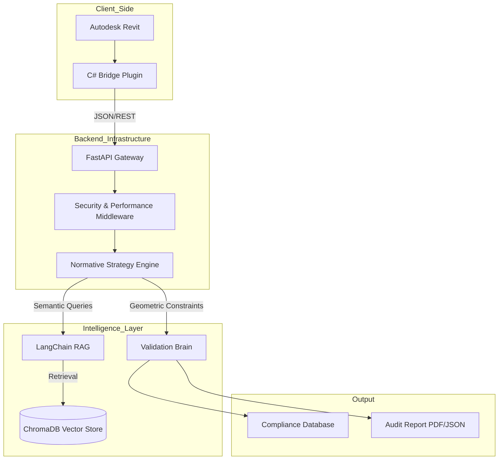

# <p align="center">BIM-Lawyer | Production-Grade Normative Audit Engine</p>

<p align="center">
  
</p>

<p align="center">
  
  
  
  
  
</p>

---

### 🏛️ Architecture & Global Logic

**BIM-Lawyer** is an enterprise-grade normative auditing system for AEC workflows. Engineered to bridge the gap between building codes and 3D geometry, it implements an asynchronous pipeline for real-time compliance validation.

Inspired by the technical precision of **EcoBIM-Logic**, this system utilizes a multi-tier architecture to ensure scalability and regulatory accuracy.


```mermaid
graph TD
    subgraph Client_Side
        A[Autodesk Revit] --> B[C# Bridge Plugin]
    end
    subgraph Backend_Infrastructure
        B -- JSON/REST --> C[FastAPI Gateway]
        C --> D[Security & Performance Middleware]
        D --> E[Normative Strategy Engine]
    end
    subgraph Intelligence_Layer
        E -- Geometric Constraints --> F[Validation Brain]
        E -- Semantic Queries --> G[LangChain RAG]
        G -- Retrieval --> H[(ChromaDB Vector Store)]
    end
    subgraph Output
        F --> I[Compliance Database]
        F --> J[Audit Report PDF/JSON]
    end
```

### 🚀 Advanced Capabilities

- **High-Density Data Extraction:** Custom C# manifest collecting spatial parameters, hierarchy, and metadata directly from the Revit database.
- **Deterministic Validation:** Rule-based engine using the **Strategy Pattern** to handle jurisdictional variations (ADA, IBC, NBR).
- **IA-Driven Foundation:** Retrieval-Augmented Generation (RAG) providing legal justification for every geometric violation discovered.
- **Enterprise Reporting:** Automated generation of professional compliance summaries for stakeholder review.

---

### 📂 Repository Structure

- **`api/`**: Authentication layers, performance middleware, and APIRouter.
- **`config/`**: Centralized settings for global state and environment variables.
- **`core/`**: The validation engine, geometric utilities, and Pydantic schemas.
- **`database/`**: Vector store artifacts and local normative definitions.
- **`docker/`**: Production-ready containerization logic.
- **`plugin/`**: Modular C# source code for Revit integration.
- **`utils/`**: Enterprise logging and professional PDF report generation.
- **`tests/`**: Unit and integration test suites for core logic.

---

### 🛠️ Professional Setup

#### Requirements
- Python 3.12+
- Visual Studio 2022 (for C# components)
- Docker (optional)

#### Deployment
```bash
# Backend Setup
pip install -r requirements.txt
uvicorn api.main:app --reload

# Revit Setup
# Build the .csproj file to deploy the .addin manifest automatically.
```

---

<p align="center">
  <b>Developed by Maycon Alves</b><br>
  <i>BIM Developer | AEC Technology Specialist</i>
</p>

<p align="center">
  <a href="https://github.com/MayconAlvesss">
    
  </a>
  <a href="https://www.linkedin.com/in/mayconalvess/">
    
  </a>
</p>
